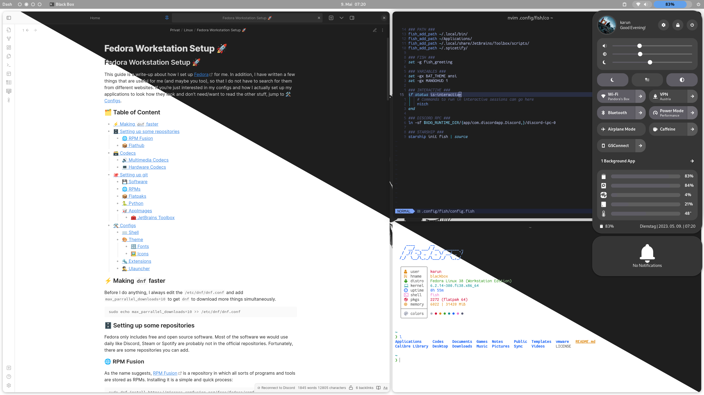

# Fedora Workstation Setup 🚀
This guide is a write-up about how I set up [Fedora]([https://getfedora.com](https://fedoraproject.org/)) for me. In addition, I have written a few things that are useful for me (and maybe you too), so that I do not have to search for them from different websites. If you’re just interested in my configs and how I actually set up my applications to look how they look and don’t need/want to read the other stuff, jump to [🛠️ Configs](#configs).



## 🗂️ Table of Content
- [⚡ Making `dnf` Faster](#making-dnf-faster)
- [🗄️ Setting Up Some Repositories](#setting-up-some-repositories)
	- [🌐 RPM Fusion](#rpm-fusion)
	- [📦 Flathub](#flathub)
- [🗃️ Codecs](#codecs)
	- [🔊 Multimedia Codecs](#multimedia-codecs)
	- [💻 Hardware Codecs](#hardware-codecs)
- [🐙 Setting up git](#setting-up-git)
- [💾 Software](#software)
	- [🌐 RPMs](#rpms)
	- [📦 Flatpaks](#flatpaks)
	- [🐍 Python](#python)
	- [🥡 AppImages](#appimages)
		- [🧰 JetBrains Toolbox](#jetbrains-toolbox)
- [🛠️ Configs](#configs)
	- [⌨️ Terminal & Shell](#terminal-and-shell)
	- [🎨 Theme](#theme)
		- [🔣 Fonts](#fonts)
		- [🖼️ Icons](#icons)
		- [👆 Cursor](#cursor)
		- [🦊 Firefox](#firefox)
	- [🔩 Extensions](#extensions)
	- [🕵️‍♂️ Ulauncher](#ulauncher)
	- [⚙️ Keyboard Shortcuts](#keyboard-shortcuts)

## ⚡ Making `dnf` Faster <a name='making-dnf-faster'/>
Before I do anything, I always edit the `/etc/dnf/dnf.conf` and add `max_parrallel_downloads=10` to get `dnf` to download more things simultaneously.

```sh
sudo echo max_parrallel_downloads=10 >> /etc/dnf/dnf.conf
```

## 🗄️ Setting Up Some Repositories <a name='setting-up-some-repositories'/>
Fedora only includes free and open source software. Most of the software we would use daily like Discord, Steam or Spotify are probably not in the official repositories. Fortunately, there are some repositories you can add.

### 🌐 RPM Fusion <a name='rpm-fusion'/>
As the name suggests, [RPM Fusion](https://rpmfusion.org) is a repository in which all sorts of programs and tools are stored as RPMs. Installing it is a simple and quick process:

```sh
sudo dnf install https://mirrors.rpmfusion.org/free/fedora/rpmfusion-free-release-$(rpm -E %fedora).noarch.rpm https://mirrors.rpmfusion.org/nonfree/fedora/rpmfusion-nonfree-release-$(rpm -E %fedora).noarch.rpm
```

### 📦 Flathub <a name='flathub'/>
[Flathub](https://flathub.org) is a repository for [flatpak](https://flatpak.org) applications. Flatpaks are distro agnostic, meaning they can be installed on pretty much every Linux distribution. On Fedora 37 and below the Flathub Repository must be installed manually, but after this release Fedora will automatically enable Flathub if you clicked enable third party repositories on installation.

```sh
flatpak remote-add --if-not-exists flathub https://flathub.org/repo/flathub.flatpakrepo
```

## 🗃️ Codecs <a name='codecs'/>
Because of the nature of Fedora, proprietary codecs are not included, even though some applications need these codecs to work correctly.

### 🔊 Multimedia Codecs <a name='multimedia-codecs'/>
These commands will install all the packages and codecs required for `gstreamer` enabled applications.

```sh
sudo dnf groupupdate multimedia --setop='install_weak_deps=False' --exclude=PackageKit-gstreamer-plugin
sudo dnf groupupdate sound-and-video
```

### 💻 Hardware Codecs <a name='hardware-codecs'/>
Fedora has removed VA-API Support from the mesa drivers in Fedora 37. Fortunately, RPM Fusion repackaged the drivers with the needed flags. These two commands swap the Fedora drivers with the RPM Fusion ones:

```sh
sudo dnf swap mesa-va-drivers mesa-va-drivers-freeworld
sudo dnf swap mesa-vdpau-drivers mesa-vdpau-drivers-freeworld
```

## 🐙 Setting up git <a name='setting-up-git'/>
If you do not know what [git](https://git-scm.com/) is, here is a short explanation: It is a distributed version control system used for tracking changes in code. It allows multiple developers to collaborate on a project while maintaining a history of all changes made.  
This section is not important for you if you are only looking to use my configs. The following commands generate an ssh key, set up your git username and email, and tell git to use the ssh key to sign commits.

```shell
ssh-keygen -t ed25519 -C 'your_email@example.com' -f .ssh/git
git config --global user.name 'username'
git config --global user.email 'your_email@example.com'
git config --global gpg.format ssh
git config --global user.signingkey .ssh/git.pub
```

## 💾 Software <a name='software'/>
This section could be to no use of you, but that's the stuff I use. Because I always forget what I had actually installed on my last install, I keep this list pretty much always up to date. The installation methods separate the commands. So all RPMs are under [🌐 RPMs](#rpms) and all AppImages under [🥡 AppImages](#appimages).

### 🌐 RPMs <a name='rpms'/>
```sh
sudo dnf install \
bat \
btop \
cowsay \
dconf-editor \
exa \
fds-find \
fish \
fzf \
g++ \
gnome-tweaks \
goverlay \
java-latest-openjdk \
lolcat \
nautilus-python \
neovim \
obs-studio \
openssl \
pandoc \
pandoc \
poetry \
steam \
syncthing \
telnet \
tldr \
touchegg \
yt-dlp \
-y
```

### 📦 Flatpaks <a name='flatpaks'/>
```sh
flatpak install flathub \
com.bitwarden.desktop \
com.discordapp.Discord \
com.github.tchx84.Flatseal \
com.github.wwmm.easyeffects \
com.mattjakeman.ExtensionManager \
com.spotify.Client \
com.usebottles.bottles \
de.haeckerfelix.Fragments \
io.github.Foldex.AdwSteamGtk \
io.github.trigg.discover_overlay \
md.obsidian.Obsidian \
net.davidotek.pupgui2 \
org.freedesktop.Platform.VulkanLayer.MangoHud \
org.gnome.World.PikaBackup \
org.gtk.Gtk3theme.adw-gtk3 \
org.gtk.Gtk3theme.adw-gtk3-dark \
org.signal.Signal \
-y
```

### 🥡 AppImages <a name='appimages'/>

#### 🧰 JetBrains Toolbox <a name='jetbrains-toolbox'/>
[JetBrains Toolbox](https://www.jetbrains.com/toolbox-app/) is a tool to install, manage and keep all your JetBrains programs updated. I’ve tried using the Flatpaks, but their sandbox is just too limiting, and the IDEs are not available in the repositories, so that's the next best thing besides just installing them separately. To get to using it, just download the AppImage from the link above. After downloading it, these 5 command will get you going:

```sh
cd ~/Downloads/
tar xzf jetbrains-toolbox*.tar.gz
rm jetbrains-toolbox*.tar.gz
cd jetbrains-toolbox-*
./jetbrains-toolbox
```

## 🛠️ Configs <a name='configs'/>
First up we’re going to get my configs from the GitHub repository. These commands will clone the repository into `~/.dotfiles` and disable showing untracked files:

```sh
git clone --bare git@github.com:MrSom3body/dotfiles.git $HOME/.dotfiles
dots config --local status.showUntrackedFiles no
```

Now that we have cloned my repository, we can get all my configs by using the following two commands (all existing configs will be moved to the `~/.dotfiles-backup`):

```sh
dots checkout 2>&1 | egrep '\s+\.' | awk {'print $1'} | xargs -I{} mv {} .dotfiles-backup/{}
dots checkout
```

Now that we got all configs, let's set everything up. There will be sections for the different tools and applications I use and how I set them up.

### ⌨️ Terminal & Shell <a name='terminal-and-shell'/>
That’s probably the most important part for me because I use my terminal for many kinds of important things like editing files and running fetches. The advantage of the shell is everything can be done with commands in the terminal (most if not all GUI things too, but not as easy).

The terminal emulator that I use is called [Black Box](https://gitlab.gnome.org/raggesilver/blackbox). I have this [script](https://github.com/dr3mro/blackbox-installer) in my repository to install Black Box and configure it as your default terminal emulator on GNOME. You need to rerun the script when you install a terminal program so that it can create a shortcut to run it with Black Box and not the default gnome terminal. The script is located in your PATH if you have cloned my repo and thus should be runnable:

```
blackbox-installer.sh
```

After that install [starship](https://starship.rs) to have an easy customizable prompt for pretty much all shells. On Fedora, there is a copr available to keep starship up to date.

```sh
sudo dnf copr enable atim/starship  
sudo dnf install starship
```

If you have cloned my repository and are using my configs, you don’t need to do anything anymore and the prompt should now be starship and not the default fish one.

### 🎨 Theme <a name='theme'/>
So that section isn’t really theming because I’m just applying, [adw-gtk3](https://github.com/lassekongo83/adw-gtk3), a libadwaita port to GTK-3. Installing and setting this theme is as easy as using four commands:

```sh
sudo dnf copr enable nickavem/adw-gtk3
sudo dnf install adw-gtk3
flatpak install org.gtk.Gtk3theme.adw-gtk3 org.gtk.Gtk3theme.adw-gtk3-dark
gsettings set org.gnome.desktop.interface gtk-theme 'adw-gtk3-dark' && gsettings set org.gnome.desktop.interface color-scheme 'prefer-dark'
```

Now, if you want to auto switch between light and dark mode, you will need to use the [Night Theme Switcher](https://extensions.gnome.org/extension/2236/night-theme-switcher/) Extension. In there, you can select which Theme should be used for legacy applications in light and dark mode.

#### 🔣 Fonts <a name='fonts'/>
I use the default [Cantarell](https://cantarell.gnome.org/) font that comes with [GNOME](https://gnome.org), but I use Fantasque Sans Mono, a [Nerd Font](https://www.nerdfonts.com/), as the Monospaced font. The font is in my repository and is in the correct directory to be detected by your font picker and your terminal. If you want to use another font or want to get the fonts yourself, you just need to download the font and move the extracted font to `~/.local/share/fonts`. The following command set the fonts to a bigger font size for interface, document, monospaced and legacy window title fonts and uses Fantasque Sans Mono as the monospaced font:

```sh
gsettings set org.gnome.desktop.interface font-name 'Cantarell 13' # set the interface font
gsettings set org.gnome.desktop.interface document-font-name 'Cantarell 13' # set the document font
gsettings set org.gnome.desktop.interface monospace-font-name 'FantasqueSansM Nerd Font 12' # set the monospace font
gsettings set org.gnome.desktop.wm.preferences titlebar-font 'Cantarell Bold 13' # set the legacy window font
```

#### 🖼️ Icons <a name='icons'/>
For icons, I use the [Papirus icon theme](https://github.com/PapirusDevelopmentTeam/papirus-icon-theme) with the [Papirus Folders script](https://github.com/PapirusDevelopmentTeam/papirus-folders). Installing both the icon theme and the script, setting the icons themselves and setting the folder color to black takes only the following four commands:

```sh
sudo dnf install papirus-icon-theme
wget -qO- https://git.io/papirus-folders-install | sh
gsettings set org.gnome.desktop.interface icon-theme 'Papirus'
papirus-folders -C black
```

If the folder color should change back in the future, just run the last command to set it to black again.

#### 👆 Cursor <a name='cursor'/>
I use [Bibata Cursor](https://github.com/ful1e5/Bibata_Cursor) as my cursor set. It can be downloaded from [GitHub Releases](https://github.com/ful1e5/Bibata_Cursor/releases/latest) and [pling](https://www.pling.com/p/1914825/). Then it needs to be moved into `~/.local/share/icons`. It is also in my GitHub repository in the correct directory. The following command will activate the cursor:

```sh
gsettings set org.gnome.desktop.interface cursor-theme 'Bibata-Modern-Classic'
```

#### 🦊 Firefox <a name="firefox"/>
I also use the [Firefox GNOME theme](https://github.com/rafaelmardojai/firefox-gnome-theme) to make Firefox integrate better with the libadwaita theme. Installing it takes only one command:

```sh
curl -s -o- https://raw.githubusercontent.com/rafaelmardojai/firefox-gnome-theme/master/scripts/install-by-curl.sh | bash
```

### 🔩 Extensions <a name='extensions'/>
Extensions are a big part for me when using GNOME. The following list contains the extensions I always install and use. I won’t write up how I set them up because I’m too lazy and most of that is visible in the Screenshots.
- [AppIndicator and KStatusNotifierItem Support](https://extensions.gnome.org/extension/615/appindicator-support/)
- [Aylur’s Widgets](https://extensions.gnome.org/extension/5338/aylurs-widgets/)
- [Blur my Shell](https://extensions.gnome.org/extension/3193/blur-my-shell/)
- [Caffeine](https://extensions.gnome.org/extension/517/caffeine/)
- [Custom Accent Colors](https://extensions.gnome.org/extension/5547/custom-accent-colors/)
- [GameMode](https://extensions.gnome.org/extension/1852/gamemode/)
- [GSConnect](https://extensions.gnome.org/extension/1319/gsconnect/)
- [Night Theme Switcher](https://extensions.gnome.org/extension/2236/night-theme-switcher/)
- [Notification Banner Reloaded](https://extensions.gnome.org/extension/4651/notification-banner-reloaded/)
- [Rounded Window Corners](https://extensions.gnome.org/extension/5237/rounded-window-corners/)
- [Tiling Assistant](https://extensions.gnome.org/extension/3733/tiling-assistant/)
- [User Themes](https://extensions.gnome.org/extension/19/user-themes/)
- [X11 Gestures](https://extensions.gnome.org/extension/4033/x11-gestures/)

### 🕵️‍♂️ Ulauncher <a name='ulauncher'/>
[Ulauncher](https://ulauncher.io/) is an application launcher on Linux with extension and theme support. If you are using my configs, Ulauncher should have the libadwaita theme installed and set. The extensions I use with Ulauncher are the following:
- [Emoji](https://github.com/Ulauncher/ulauncher-emoji)
- [Calculate Anything](https://github.com/tchar/ulauncher-albert-calculate-anything)  
	Calculate Anything needs some Python dependencies to be installed. These can be easily installed with the following commands:
	```sh
	sudo dnf install \
	python-parsedatetime \
	python-pint \
	python-pytz \
	python-simpleeval \
	-y
	```
- [File Search](https://github.com/brpaz/ulauncher-file-search)
- [Process Murderer](https://github.com/isacikgoz/ukill)
- [Obsidian](https://github.com/mikebarkmin/ulauncher-obsidian)

### ⚙️ Keyboard Shortcuts <a name='keyboard-shortcuts'/>
I also have some keyboard shortcuts set that are very handy. Before you can set the individually, you must run this command first to create the places to store the following shortcuts:

```sh
gsettings set org.gnome.settings-daemon.plugins.media-keys custom-keybindings ['/org/gnome/settings-daemon/plugins/media-keys/custom-keybindings/custom0/', '/org/gnome/settings-daemon/plugins/media-keys/custom-keybindings/custom1/', '/org/gnome/settings-daemon/plugins/media-keys/custom-keybindings/custom2/']
```

- Open Black Box with `Ctrl + Alt + T`:
  ```sh
  gsettings set org.gnome.settings-daemon.plugins.media-keys.custom-keybinding:/org/gnome/settings-daemon/plugins/media-keys/custom-keybindings/custom0/ name 'Black Box'
  gsettings set org.gnome.settings-daemon.plugins.media-keys.custom-keybinding:/org/gnome/settings-daemon/plugins/media-keys/custom-keybindings/custom0/ command 'blackbox'
  gsettings set org.gnome.settings-daemon.plugins.media-keys.custom-keybinding:/org/gnome/settings-daemon/plugins/media-keys/custom-keybindings/custom0/ binding '<Control><Alt>t'
  ```
- Open Nautilus with `Super + E`:
  ```sh
  gsettings set org.gnome.settings-daemon.plugins.media-keys.custom-keybinding:/org/gnome/settings-daemon/plugins/media-keys/custom keybindings/custom1/ name 'Nautilus'
  gsettings set org.gnome.settings-daemon.plugins.media-keys.custom-keybinding:/org/gnome/settings-daemon/plugins/media-keys/custom-keybindings/custom1/ command 'nautilus'
  gsettings set org.gnome.settings-daemon.plugins.media-keys.custom-keybinding:/org/gnome/settings-daemon/plugins/media-keys/custom-keybindings/custom1/ binding '<Super>e'
  ```
- Open Ulauncher with `Ctrl + Space`:
  ```sh
  gsettings set org.gnome.settings-daemon.plugins.media-keys.custom-keybinding:/org/gnome/settings-daemon/plugins/media-keys/custom-keybindings/custom2/ name 'Ulauncher'
  gsettings set org.gnome.settings-daemon.plugins.media-keys.custom-keybinding:/org/gnome/settings-daemon/plugins/media-keys/custom-keybindings/custom2/ command 'ulauncher-toggle'
  gsettings set org.gnome.settings-daemon.plugins.media-keys.custom-keybinding:/org/gnome/settings-daemon/plugins/media-keys/custom-keybindings/custom2/ binding '<Control>space'
  ```
