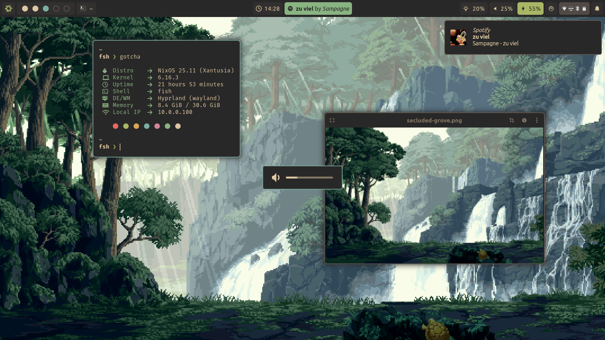
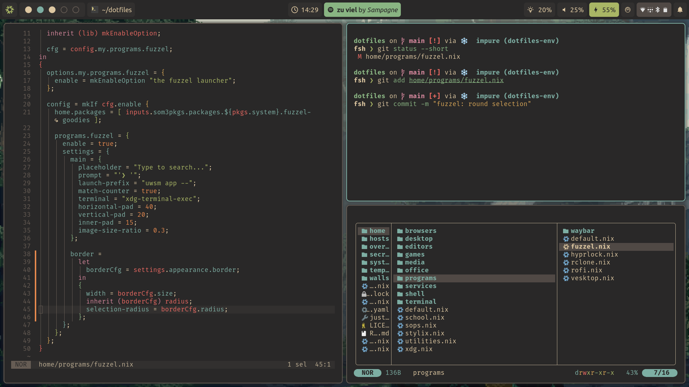
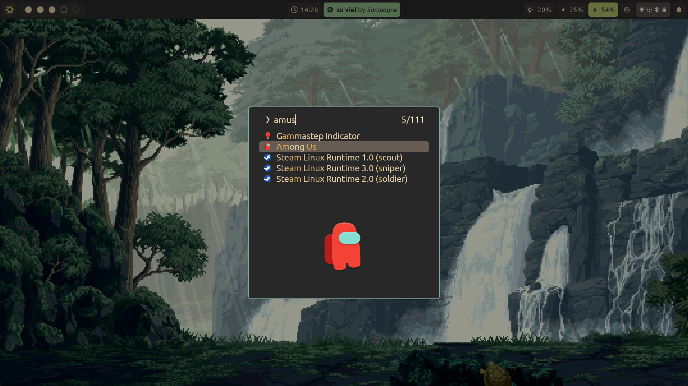

# 🖥️ dotfiles

Welcome to my dotfiles repository!

These configurations are built primarily for _my workflow_ and systems, but thanks to the incredibly modular [Dendritic Pattern](https://github.com/mightiam/dendritic), you can easily mix, match, and adapt whatever you like for your own environment.

## 🖼️ Showcase

## 💾 Credits & Resources

I’ve drawn inspiration from these fantastic projects, people and sources:

- [The Dendritic Pattern](https://github.com/mightiam/dendritic)
- [drupol/infra](https://github.com/drupol/infra) and his [article](https://not-a-number.io/2025/refactoring-my-infrastructure-as-code-configurations/)
- [fufexan/dotfiles](https://github.com/fufexan/dotfiles) (shamelessly copied most of the nix stuff from him)
- [NixOS & Flakes Book](https://nixos-and-flakes.thiscute.world/)
- [Misterio77/nix-config](https://github.com/Misterio77/nix-config)
- [NotAShelf/nyx](https://github.com/NotAShelf/nyx) (mainly for the CI/CD stuff)
- [librephoenix/nixos-config](https://github.com/librephoenix/nixos-config)
- [Vimjoyer](https://www.youtube.com/@vimjoyer)
- [Automatic Flake Updates](https://xyven.dev/articles/automatic-flake-updates-with-garnix)
- and many many more...

Feel free to explore, adapt, and contribute!

## ⭐ Stargraph (because why not)

<a href="https://www.star-history.com/#MrSom3body/dotfiles&Date">
<picture>
  <source media="(prefers-color-scheme: dark)"
    srcset="https://api.star-history.com/svg?repos=MrSom3body/dotfiles&type=Date&theme=dark"/>
  <source media="(prefers-color-scheme: light)"
    srcset="https://api.star-history.com/svg?repos=MrSom3body/dotfiles&type=Date"/>
  
</picture>
</a>
