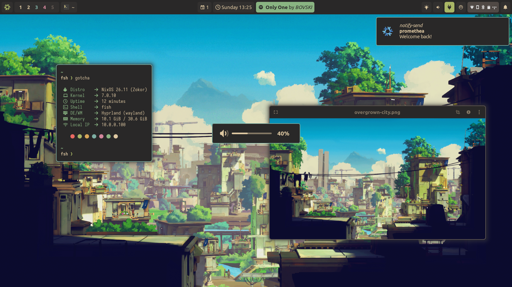
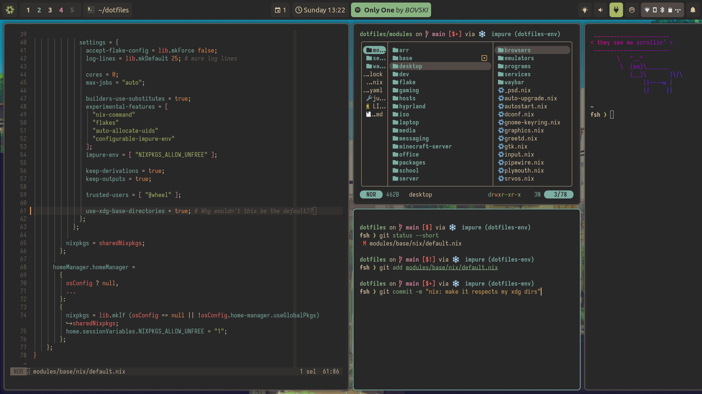
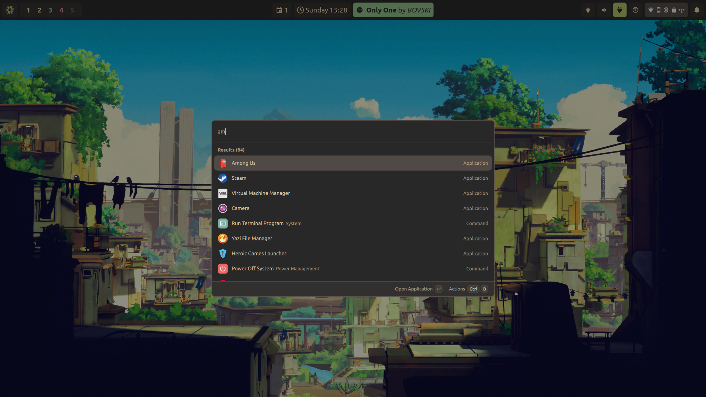
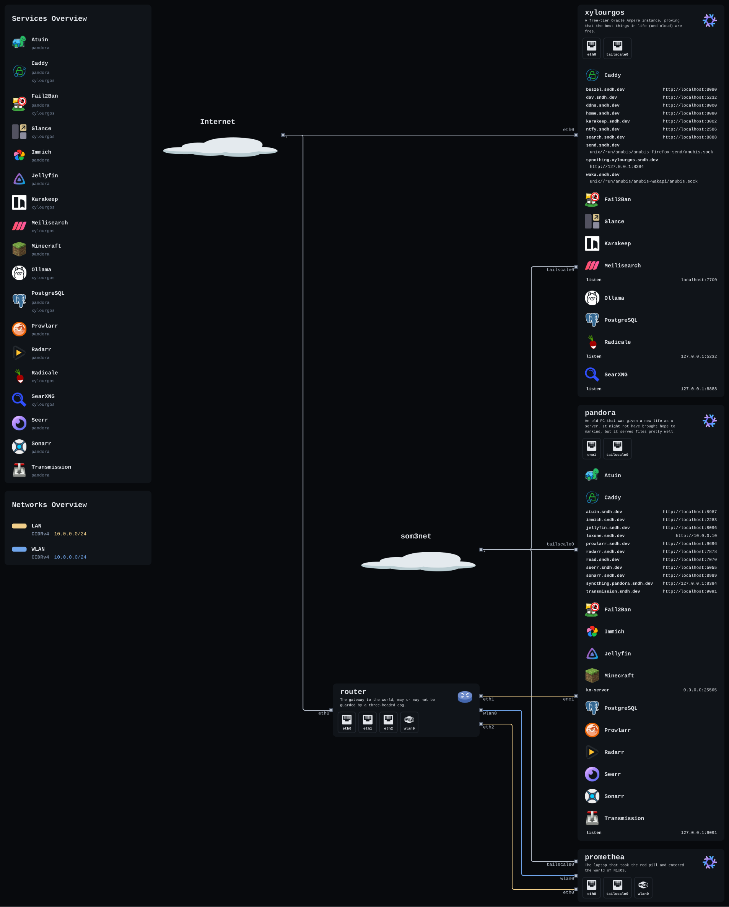

# 🖥️ dotfiles

 
(wow I <s>wasted</s> invested so much time?)

Welcome to my dotfiles repository!

These configurations are built primarily for _my workflow_ and systems, but thanks to the incredibly modular [Dendritic Pattern](https://github.com/mightyiam/dendritic), you can easily mix, match, and adapt whatever you like for your own environment.

## 💻 Systems

Here is an overview of the systems managed in this repository, including some stats and their primary roles:

| Host            | Type      | Architecture    | CPU                | RAM       | GPU          | Key Roles / Features                            |
| :-------------- | :-------- | :-------------- | :----------------- | :-------- | :----------- | :---------------------------------------------- |
| **`promethea`** | 💻 Laptop | `x86_64-linux`  | AMD Ryzen 9 6900HX | 32GB DDR5 | RTX 3050 4GB | Main Daily Driver, Development, Gaming          |
| **`pandora`**   | 🗄️ Server | `x86_64-linux`  | Intel i5-4590      | 8GB DDR3  | -            | Media Server, Home Automation, Minecraft Server |
| **`xylourgos`** | ☁️ VPS    | `aarch64-linux` | ARM (4 Cores)      | 24GB      | -            | Services Hub, Search, Monitoring Hub            |
| **`athenas`**   | 💿 ISO    | `x86_64-linux`  | Any                | Any       | -            | Graphical Rescue System                         |
| **`sanctuary`** | 💿 ISO    | `x86_64-linux`  | Any                | Any       | -            | Minimal System Installer                        |

## 📦 Packages

You can find all my custom packages in this repo to import them into your flake.

| Package                | Use                                                                                                                          |
| ---------------------- | ---------------------------------------------------------------------------------------------------------------------------- |
| `auto-kbd-bl`          | Automatically turn the keyboard backlight on when the screen brightness falls under a threshold                              |
| `fnott-dnd`            | Toggle `fnott`'s DND status (because it doesn't provide a way to toggle it :( )                                              |
| `fuzzel-goodies`       | Fuzzel scripts for a bunch of functionality like: emoji picker, file picker, hyprland window picker, ...                     |
| `gns3-auto-confg`      | Automatically create basic configuration files for cisco devices                                                             |
| `hypr-focus-or-launch` | Allows to focus or run a program if not already open on Hyprland                                                             |
| `hyprcast`             | Record your screen with wl-screenrec with notification support (most useful when run with a key bind)                        |
| `power-monitor`        | Automatically switch between power-saver and performance mode when plugging or unplugging your laptop (copied from @fufexan) |
| `send-to-phone`        | Send files or URLs to a KDE Connect device with an interactive picker                                                        |
| `touchpad-toggle`      | Toggle your touchpad on Hyprland                                                                                             |
| `vicinae-goodies`      | Vicinae scripts for monitor management and vpnc connections                                                                  |
| `waybar-update`        | Waybar module to display an icon if there is a new generation available (e. g. after an update)                              |
| `wl-ocr`               | OCR your screen on wayland                                                                                                   |

## 🖼️ Showcase

## 🌐 Topology

## 💾 Credits & Resources

I’ve drawn inspiration from these fantastic projects, people and sources:

- [The Dendritic Pattern](https://github.com/mightiam/dendritic)
- [drupol/infra](https://github.com/drupol/infra) and his [article](https://not-a-number.io/2025/refactoring-my-infrastructure-as-code-configurations/)
- [fufexan/dotfiles](https://github.com/fufexan/dotfiles) (shamelessly copied most of the nix stuff from him)
- [NixOS & Flakes Book](https://nixos-and-flakes.thiscute.world/)
- [Misterio77/nix-config](https://github.com/Misterio77/nix-config)
- [NotAShelf/nyx](https://github.com/NotAShelf/nyx) (mainly for the CI/CD stuff)
- [librephoenix/nixos-config](https://github.com/librephoenix/nixos-config)
- [Vimjoyer](https://www.youtube.com/@vimjoyer)
- [Automatic Flake Updates](https://xyven.dev/articles/automatic-flake-updates-with-garnix)
- [poz/niksos](https://git.poz.pet/poz/niksos)
- and many many more...

Feel free to explore, adapt, and contribute!

## ⭐ Stargraph (because why not)

<a href="https://www.star-history.com/#MrSom3body/dotfiles&Date">
<picture>
  <source media="(prefers-color-scheme: dark)"
    srcset="https://api.star-history.com/svg?repos=MrSom3body/dotfiles&type=Date&theme=dark"/>
  <source media="(prefers-color-scheme: light)"
    srcset="https://api.star-history.com/svg?repos=MrSom3body/dotfiles&type=Date"/>
  
</picture>
</a>
