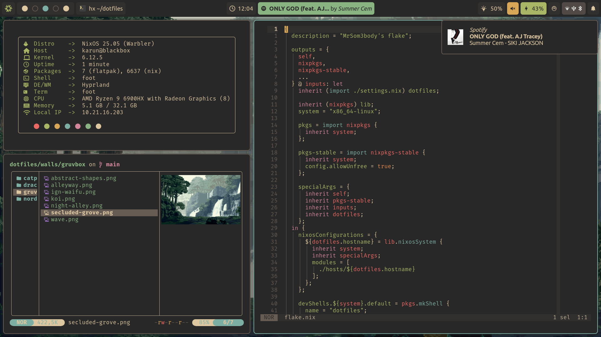

# 🖥️ MrSom3body/dotfiles

Welcome to my dotfiles repository! These configurations are tailored to me and
my system only (for now), so if you really want to copy my configs don't just
blindly use them but rather use them as a starting point.

## 📦 Packages

My repository also provides some packages that may be useful for you:

| Package           | Use                                                                                                      |
| ----------------- | -------------------------------------------------------------------------------------------------------- |
| `fuzzel--goodies` | Fuzzel scripts for a bunch of functionality like: emoji picker, file picker, hyprland window picker, ... |
| `hyprcast`        | Record your screen with wl-screenrec with notification support (most useful when run with a key bind)    |
| `wl-ocr`          | OCR your screen on wayland                                                                               |

## 🖼️ Showcase

## 💾 Credits & Resources

I’ve drawn inspiration from these fantastic projects, people and sources:

- [fufexan/dotfiles](https://github.com/fufexan/dotfiles) (shamelessly copied
  most of the nix stuff from him)
- [librephoenix/nixos-config](https://github.com/librephoenix/nixos-config)
- [NixOS & Flakes Book](https://nixos-and-flakes.thiscute.world/)
- [Vimjoyer](https://www.youtube.com/@vimjoyer)
- and many many more...

Feel free to explore, adapt, and contribute!
