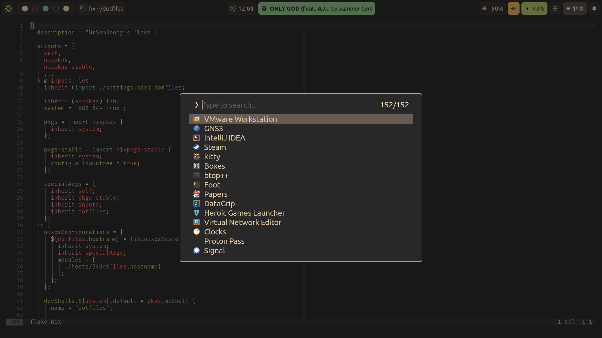

# 🖥️ MrSom3body/dotfiles

Welcome to my dotfiles repository! These configurations are tailored to me and
my system only (for now), so if you really want to copy my configs don't just
blindly use them but rather use them as a starting point.

## 🧪 Try It

You can also try my configuration in a VM extremely easy if you're running NixOS
with this simple command:

```bash
nixos-rebuild build-vm --flake github:MrSom3body/dotfiles#nixos
```

If you want to use my configuration you'll need a few things:

1. a hardware configuration file (will be created on initial installation under
   `/etc/nixos/hardware-configuration.nix`)
2. a directory under `./hosts` (look at `./hosts/blackbox` for an example)

Move the `hardware-configuration.nix` file to your own host directory. After
that edit the `default.nix` file and import your hardware configuration and
everything else you want.

Chances are you don't have the same name, so just change it in `./settings.nix`.

Finally, rebuild the configuration, and you're done :)

## 📦 Packages

My repository also provides some packages that may be useful for you:

| Package          | Use                                                                                                      |
| ---------------- | -------------------------------------------------------------------------------------------------------- |
| `fuzzel-goodies` | Fuzzel scripts for a bunch of functionality like: emoji picker, file picker, hyprland window picker, ... |
| `hyprcast`       | Record your screen with wl-screenrec with notification support (most useful when run with a key bind)    |
| `wl-ocr`         | OCR your screen on wayland                                                                               |

## 🖼️ Showcase




## 💾 Credits & Resources

I’ve drawn inspiration from these fantastic projects, people and sources:

- [fufexan/dotfiles](https://github.com/fufexan/dotfiles) (shamelessly copied
  most of the nix stuff from him)
- [librephoenix/nixos-config](https://github.com/librephoenix/nixos-config)
- [NixOS & Flakes Book](https://nixos-and-flakes.thiscute.world/)
- [Vimjoyer](https://www.youtube.com/@vimjoyer)
- and many many more...

Feel free to explore, adapt, and contribute!

## ⭐ Stargraph (because why not)

<picture>
  <source media="(prefers-color-scheme: dark)"
    srcset="https://api.star-history.com/svg?repos=MrSom3body/dotfiles&type=Date&theme=dark"/>
  <source media="(prefers-color-scheme: light)"
    srcset="https://api.star-history.com/svg?repos=MrSom3body/dotfiles&type=Date"/>
  
</picture>
